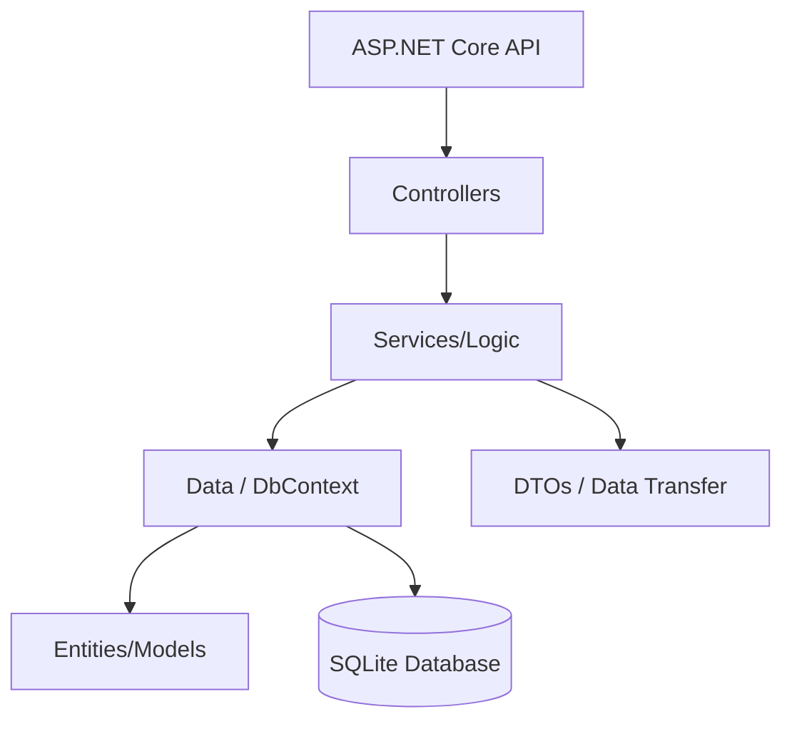

# 🚀 API BACKEND1: Sistema de Notas Encriptadas

Sistema de gestión de notas con compartición controlada, permisos de acceso, auditoría y seguridad robusta mediante JWT y AES-256.

**Desarrollado por:** Aaron Téllez

---

## 📌 Objetivo del proyecto
Desarrollar una API REST segura que permita a los usuarios gestionar notas personales encriptadas. El sistema soporta compartición controlada entre usuarios y cumple con un modelo de dominio de más de 5 entidades.

### Capacidades principales:
* 🔐 **Seguridad:** Registro e inicio de sesión con JWT.
* 🛡️ **Privacidad:** Notas personales encriptadas con AES-256.
* 🤝 **Colaboración:** Compartición de notas con otros usuarios.
* 🚦 **Control:** Gestión de permisos (lectura/escritura) y auditoría.
* 📖 **Documentación:** Autogenerada con Swagger (OpenAPI).

El proyecto simula un sistema real de notas privadas similar a Notion, Simplenote o Google Keep, con énfasis en seguridad backend, criptografía y control de acceso.

---

## 🧠 ¿Qué problemática resuelve?
Este proyecto aborda fallos comunes en sistemas de información tradicionales:
- [x] **Privacidad:** Evita que las notas se almacenen en texto plano.
- [x] **Aislamiento:** Garantiza que los datos solo sean accesibles por el dueño o autorizados.
- [x] **Trazabilidad:** Registro de acciones relevantes mediante logs de auditoría.
- [x] **Portabilidad:** Base de datos ligera (SQLite) fácil de desplegar.

---

## 🧱 Tecnologías utilizadas
* **Lenguaje/Framework:** C# / ASP.NET Core (.NET 9)
* **ORM:** Entity Framework Core
* **Base de Datos:** SQLite
* **Seguridad:** JWT (JSON Web Tokens) & AES-256 (Criptografía)
* **Documentación:** Swagger (OpenAPI)

> **¿Por qué .NET?** Se eligió por ser un framework robusto con soporte nativo para criptografía, alto rendimiento y una excelente integración con herramientas industriales y educativas ademas de su integracoin automatica con Swagger.

---

## 🔐 Seguridad y Criptografía

### 1. Autenticación JWT
La API utiliza tokens para validar la identidad.
- **Flujo:** Registro -> Login -> Obtención de Token -> Envío en Header.
- **Header Requerido:** `Authorization: Bearer <TOKEN>`

### 2. Encriptación AES-256
El contenido de las notas nunca toca el disco en texto plano.
- **Algoritmo:** AES de 32 bytes.
- **Persistencia:** Almacenado en Base64 tras la encriptación.

### 3. Flujo de encriptación

1. El usuario envía texto plano

2. El backend lo encripta

3. Se guarda en SQLite

4. Al consultarse, se desencripta automáticamente

---

## 🧩 Entidades del Dominio

| Entidad | Descripción |
| :--- | :--- |
| **User** | Usuario autenticado del sistema. |
| **Note** | Nota personal encriptada. |
| **SharedNote** | Relación de compartición entre usuarios. |
| **Permission** | Catálogo de permisos (READ, WRITE). |
| **AuditLog** | Registro histórico de acciones. |

---

## 📜 Reglas de negocio implementadas

1. Un usuario no puede registrarse dos veces con el mismo username

2. Solo el dueño de una nota puede compartirla

3. No se puede compartir una nota inexistente

4. Una nota compartida es solo de lectura

5. Solo usuarios autenticados pueden acceder a los datos

### 👉 Controladores

Las rutas se definen mediante controladores en Controllers/ usando:

```csharp
- [ApiController]

- [Route("api/[controller]")]

- [HttpGet], [HttpPost], etc.
```

 Generando rutas como : 
```csharp
GET /api/Notes
POST /api/Notes
```

## ⚙️ Configuración y Ejecución

### Requisitos previos
- .NET 9 SDK
- Entity Framework Core Tools (`dotnet tool install --global dotnet-ef`)

### Pasos para ejecutar:
1. **Restaurar dependencias:**
```bash
dotnet restore
```
2. **Aplicar migraciones:**
```bash
dotnet ef database update
```
3. **Ejecutar la API:**
```bash
dotnet run
```
4. **Explorar la API:**
Visita `http://localhost:5063/swagger`

---

## 📡 Endpoints Principales

### Autenticación
- `POST /api/Auth/register` - Crear cuenta nueva.
- `POST /api/Auth/login` - Obtener JWT.

### Notas y Compartición
- `POST /api/Notes` - Crear nota (encriptada automáticamente).
- `POST /api/Notes/{id}/share/{userId}` - Compartir nota con otro usuario.
- `GET /api/Notes/shared/with-me` - Ver notas que otros compartieron conmigo.

### 🧪 Pruebas rápidas (CURL)

**Health Check:** 
```bash
curl http://localhost:5063/health
```
**Login**
```bash
curl -X POST http://localhost:5063/api/Auth/login \
-H "Content-Type: application/json" \
-d '{ "username": "admin", "password": "1234" }'
```

**Crear nota:**
```bash
curl -X POST http://localhost:5063/api/Notes \
-H "Authorization: Bearer <TU_TOKEN>" \
-H "Content-Type: application/json" \
-d '{ "title": "Nota", "content": "Secreto" }'
```

---

## 🏗️ Arquitectura del Proyecto



---

## ✅ Estado del Proyecto
- [x] Autenticación JWT completa.
- [x] Capa de encriptación AES funcional.
- [x] Sistema de permisos y compartición.
- [x] Documentación Swagger configurada.
- [ ] Pruebas unitarias (Posiblemente en desarrollo).

---
## 🎓 Conclusion
Este proyecto demuestra una API backend segura, extensible y profesional, aplicando conceptos reales usados en la industria:

- Seguridad

- Criptografía

- Arquitectura limpia

- Control de acceso

- Persistencia real