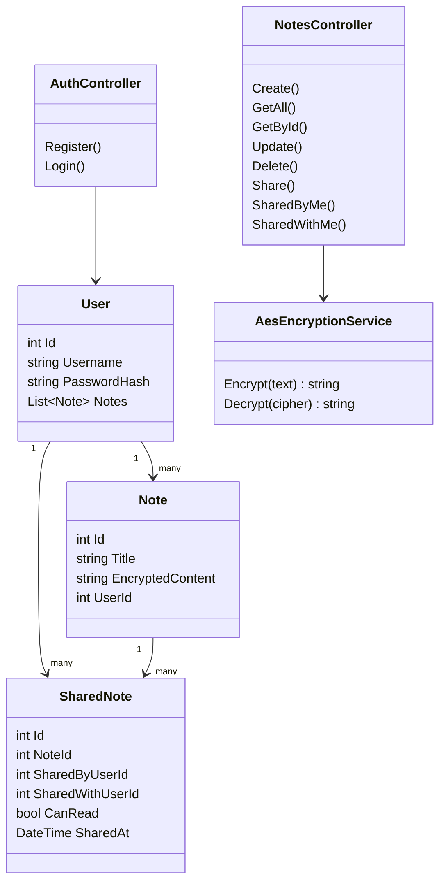

# API BACKEND1 – Sistema de Notas Encriptadas con Compartición y JWT

Proyecto desarrollado por:  
**Aaron Téllez**

---

## 📌 Objetivo del proyecto

El objetivo de este proyecto es desarrollar una **API REST segura** que permita a los usuarios:

- Registrarse e iniciar sesión de forma segura
- Crear notas personales **encriptadas**
- Compartir notas con otros usuarios
- Controlar quién puede leer una nota
- Acceder a notas propias y compartidas mediante autenticación JWT

El proyecto simula un sistema real de notas privadas similar a aplicaciones como **Notion, Simplenote o Google Keep**, pero con énfasis en **seguridad backend, criptografía y control de acceso**.

---

## 🧠 ¿Qué problemática resuelve?

Este proyecto resuelve varias problemáticas comunes:

- ❌ Notas guardadas en texto plano
- ❌ Falta de control de acceso por usuario
- ❌ APIs sin autenticación
- ❌ Compartición sin trazabilidad
- ❌ Bases de datos difíciles de desplegar

La solución implementa **encriptación AES-256**, **JWT**, **SQLite** y **Entity Framework Core**, permitiendo un backend moderno, portable y seguro.

---

## 🧱 Tecnologías utilizadas

- **C# / ASP.NET Core (.NET 9)**
- **Entity Framework Core**
- **SQLite**
- **JWT (JSON Web Tokens)**
- **AES-256**
- **Swagger (OpenAPI)**

---

## 💡 ¿Por qué usamos C# y .NET?

Elegimos **C# con ASP.NET Core** porque:

- Es un framework **robusto y profesional**
- Tiene soporte nativo para **JWT, criptografía y seguridad**
- Entity Framework Core facilita el manejo de relaciones complejas
- Excelente rendimiento
- Ideal para APIs empresariales
- Swagger se integra automáticamente
- Es ampliamente usado en la industria

---

## 🔐 Seguridad: Autenticación JWT

La API utiliza **JWT** para autenticar a los usuarios.

### Flujo de autenticación:

1. El usuario se registra
2. Inicia sesión
3. El servidor devuelve un JWT
4. El JWT se envía en cada request protegido

---

### Authorization: Bearer token

### 🔏 Encriptación AES-256

El contenido de las notas **nunca se guarda en texto plano**.

- Algoritmo: AES
- Clave: 32 bytes (AES-256)
- IV: 16 bytes
- Guardado en Base64

### Flujo:

1. El usuario envía texto plano
2. El backend lo encripta
3. Se guarda en SQLite
4. Al consultarse, se desencripta automáticamente

Ejemplo:

**Request**

```json
{
  "title": "Mi nota",
  "content": "Contenido secreto"
}
```

**Guardado en BD**

"Xk29Asl29F3s0Q9z..."

**Respuesta**

```json
{
  "id": 1,
  "title": "Mi nota",
  "content": "Contenido secreto"
}
```

### ¿Por qué Swagger y no Postman?

Swagger fue elegido porque:

1. Se genera automáticamente desde el código
2. No requiere configuración extra
3. Permite autorizar JWT con un botón
4. Muestra modelos y DTOs
5. Ideal para presentaciones académicas

Swagger actúa como documentación + Postman integrado.

## 🗄️ Base de datos: SQLite + EF Core

### ¿Por qué SQLite?

- Un solo archivo (notes.db)
- No requiere servidor
- Ideal para Render
- Compatible con EF Core
- Fácil de versionar

### Cadena de conexión:

```json
"ConnectionStrings": {
"DefaultConnection": "Data Source=notes.db"
}
```

## ⚙️ Cómo ejecutar el proyecto

1. Restaurar dependencias:

```json
dotnet restore
```

2. Aplicar Migraciones:

```json
dotnet ef database update
```

3. Ejecutar API:

```json
dotnet run
```

4. Abrir en Swagger:

```json
http://localhost:5063/swagger
```

## 📡 Endpoints del sistema

### Autenticacion

**POST /api/Auth/register**

```json
{
  "username": "alice",
  "password": "1234"
}
```

**POST /api/Auth/login**

```json
{
  "username": "alice",
  "password": "1234"
}
```

**Response**

```json
{
  "token": "jwt..."
}
```

## 📝 Notas

**POST /api/Notes**

Crea una nota encriptada.

**GET /api/Notes**

Obtiene las notas del usuario.

**GET /api/Notes/{id}**

Obtiene una nota específica.

**PUT /api/Notes/{id}**

Actualiza una nota.

**DELETE /api/Notes/{id}**

Elimina una nota.

## 🤝 Compartición de notas

**POST /api/Notes/{id}/share/{userId}**

Comparte una nota con otro usuario.

**GET /api/Notes/shared/by-me**

Notas que yo compartí.

**GET /api/Notes/shared/with-me**

Notas compartidas conmigo.

## 📜 Reglas de negocio implementadas

1. Un usuario no puede registrarse dos veces
2. Solo el dueño puede compartir una nota
3. No se puede compartir una nota inexistente
4. Las notas compartidas son solo de lectura
5. Solo usuarios autenticados acceden a datos

## 🧩 Diagrama UML



## ✅ Estado del proyecto

✔ Autenticación

✔ Encriptación

✔ Compartición

✔ Control de acceso

✔ Documentación

✔ Despliegue listo

## 🎓 Conclusión

Este proyecto demuestra una API backend profesional, segura y extensible, aplicando conceptos reales usados en la industria:

- Seguridad

- Criptografía

- Arquitectura limpia

- Control de acceso

- Persistencia real
