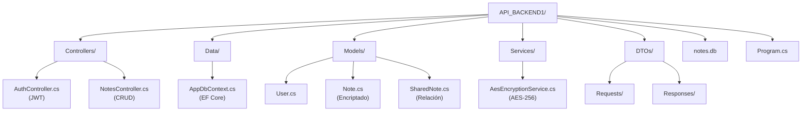

# API BACKEND1 – Sistema de Notas Encriptadas con Compartición y JWT

Proyecto desarrollado por:  
**Aaron Téllez**

---

## 📌 Objetivo del proyecto

El objetivo de este proyecto es desarrollar una **API REST segura** que permita a los usuarios:

- Registrarse e iniciar sesión de forma segura
- Crear notas personales **encriptadas**
- Compartir notas con otros usuarios
- Controlar quién puede leer una nota
- Acceder a notas propias y compartidas mediante autenticación JWT

El proyecto simula un sistema real de notas privadas similar a aplicaciones como **Notion, Simplenote o Google Keep**, pero con énfasis en **seguridad backend, criptografía y control de acceso**.

---

## 🧠 ¿Qué problemática resuelve?

Este proyecto resuelve varias problemáticas comunes:

- ❌ Notas guardadas en texto plano
- ❌ Falta de control de acceso por usuario
- ❌ APIs sin autenticación
- ❌ Compartición sin trazabilidad
- ❌ Bases de datos difíciles de desplegar

La solución implementa **encriptación AES-256**, **JWT**, **SQLite** y **Entity Framework Core**, permitiendo un backend moderno, portable y seguro.

---

## 🧱 Tecnologías utilizadas

- **C# / ASP.NET Core (.NET 9)**
- **Entity Framework Core**
- **SQLite**
- **JWT (JSON Web Tokens)**
- **AES-256**
- **Swagger (OpenAPI)**

---

## 💡 ¿Por qué usamos C# y .NET?

Elegimos **C# con ASP.NET Core** porque:

- Es un framework **robusto y profesional**
- Tiene soporte nativo para **JWT, criptografía y seguridad**
- Entity Framework Core facilita el manejo de relaciones complejas
- Excelente rendimiento
- Ideal para APIs empresariales
- Swagger se integra automáticamente
- Es ampliamente usado en la industria

---

## 🔐 Seguridad: Autenticación JWT

La API utiliza **JWT** para autenticar a los usuarios.

### Flujo de autenticación:

1. El usuario se registra
2. Inicia sesión
3. El servidor devuelve un JWT
4. El JWT se envía en cada request protegido

---

### Authorization: Bearer token

### 🔏 Encriptación AES-256

El contenido de las notas **nunca se guarda en texto plano**.

- Algoritmo: AES
- Clave: 32 bytes (AES-256)
- IV: 16 bytes
- Guardado en Base64

### Flujo:

1. El usuario envía texto plano
2. El backend lo encripta
3. Se guarda en SQLite
4. Al consultarse, se desencripta automáticamente

Ejemplo:

**Request**

```json
{
  "title": "Mi nota",
  "content": "Contenido secreto"
}
```

**Guardado en BD**

"Xk29Asl29F3s0Q9z..."

**Respuesta**

```json
{
  "id": 1,
  "title": "Mi nota",
  "content": "Contenido secreto"
}
```

## Configuración de rutas y controladores

## Controladores
Las rutas de la API se definen mediante controladores ubicados en la carpeta `Controllers/`.

Cada controlador utiliza atributos como:

- `[ApiController]`
- `[Route("api/[controller]")]`
- `[HttpGet]`, `[HttpPost]`, etc.

Ejemplo:

```csharp
[ApiController]
[Route("api/[controller]")]
public class NotesController : ControllerBase
```
## Esto genera rutas como:

```csharp 
GET /api/Notes

POST /api/Notes/{id}
```

## Registro en Program.cs

En `Program.cs` se registran los controladores y servicios:


```csharp
builder.Services.AddControllers();
app.MapControllers();
```
Esto permite que ASP.NET Core descubra automáticamente todas las rutas.


## DTOs y Servicios

- Los **DTOs** se usan para separar el contrato de la API del modelo interno.
- Los **Servicios** encapsulan lógica reutilizable (por ejemplo, cifrado AES).

Ejemplo:
- `NoteCreateDto`
- `NoteResponseDto`
- `AesEncryptionService`


## 🗄️ Base de datos: SQLite + EF Core

### ¿Por qué SQLite?

- Un solo archivo (notes.db)
- No requiere servidor
- Ideal para Render
- Compatible con EF Core
- Fácil de versionar

### Cadena de conexión:

```json
"ConnectionStrings": {
"DefaultConnection": "Data Source=notes.db"
}
```

## ⚙️ Cómo ejecutar el proyecto

1. Restaurar dependencias:

```json
dotnet restore
```

2. Aplicar Migraciones:

```json
dotnet ef database update
```

3. Ejecutar API:

```json
dotnet run
```

4. Abrir en Swagger:

```json
http://localhost:5063/swagger
```

## 📡 Endpoints del sistema

### Autenticacion

**POST /api/Auth/register**

```json
{
  "username": "alice",
  "password": "1234"
}
```

**POST /api/Auth/login**

```json
{
  "username": "alice",
  "password": "1234"
}
```

**Response**

```json
{
  "token": "jwt..."
}
```

## 🔄 Workflow de Comparticion de notas

1. Usuario A crea una nota

2. Usuario A la comparte con Usuario B

3. Se guarda una relación en SharedNotes

4. Usuario B puede verla (solo lectura)

5. El sistema registra quién la compartió y cuándo

---

## 📌 Contratos de Endpoints (Request/Response)

> Aquí se documenta el contrato de cada endpoint con ejemplos mock de request/response y códigos de estado.

###  GET /api/Notes
**Descripción:** Lista tus notas (del usuario autenticado).  
*Status 200 OK*
```json
[
  { "id": 1, "title": "Nota 1", "content": "Contenido descifrado" },
  { "id": 2, "title": "Nota 2", "content": "Otro contenido" }
]
```
###  GET /api/Notes/{id}
**Descripción:** Obtiene una nota por id si te pertenece.  
*Status 200 OK*
```json
{ "id": 1, "title": "Nota 1", "content": "Contenido descifrado" }
```
**Status 404 NotFound** 
```json
{ "message": "Nota no encontrada" }
```
### POST /api/Notes
**Descripción:** Crea una nota (se encripta en BD). 

**Request:**
```json
{ "title": "Mi nota", "content": "Secreto" }
```
**Status 201 Created**
```json
{ "id": 1, "title": "Mi nota", "content": "Secreto" }
```
### PUT /api/Notes/{id}
**Descripción:** Actualiza una nota tuya. 

**Request:** 
```json
{ "title": "Mi nota", "content": "Secreto" }
```
*Status 204 NoContent*

*Status 404 NotFound*
```json
{ "message": "Nota no encontrada" }
```
### DELETE /api/Notes/{id}
**Descripción:** Elimina una nota tuya.

*Status 204 NoContent*

*Status 404 NotFound*

```json
{ "message": "Nota no encontrada" }
```

## POST /api/Notes/{noteId}/share/{userId}
**Descripción:** Comparte una nota tuya con un usuario específico.

*Status 200 OK*

```json
{
  "message": "Nota compartida correctamente",
  "noteId": 1,
  "sharedWithUserId": 2
}
```

## GET /api/Notes/shared/by-me
**Descripción:** Lista las notas que yo he compartido.

*Status 200 OK*

```json
[
  {
    "noteId": 1,
    "title": "Nota 1",
    "sharedWithUser": "pedro",
    "sharedAt": "2026-02-01T12:00:00Z",
    "canRead": true
  }
]
```

## GET /api/Notes/shared/with-me
**Descripción:** Lista las notas que me compartieron a mi.

*Status 200 OK*

```json
[
  {
    "noteId": 1,
    "title": "Nota 1",
    "sharedBy": "juan",
    "sharedAt": "2026-02-01T12:00:00Z",
    "canRead": true
  }
]
``` 

## Pruebas rápidas

1. Health check (API viva)
```bash
curl http://localhost:5063/health
```
2. Login (Obtener el token)
```bash
curl -X POST http://localhost:5063/api/Auth/login \
  -H "Content-Type: application/json" \
  -d '{ "username": "admin", "password": "1234" }'
``` 
3. Crear nota (requiere token)
```bash
curl -X POST http://localhost:5063/api/Notes \
  -H "Authorization: Bearer <TOKEN_AQUI>" \
  -H "Content-Type: application/json" \
  -d '{ "title": "Nota", "content": "Secreto" }'
``` 


## 📜 Reglas de negocio implementadas

1. Un usuario no puede registrarse dos veces
2. Solo el dueño puede compartir una nota
3. No se puede compartir una nota inexistente
4. Las notas compartidas son solo de lectura
5. Solo usuarios autenticados acceden a datos

## Arquitectura del Proyecto




## ✅ Estado del proyecto

✔ Autenticación

✔ Encriptación

✔ Compartición

✔ Control de acceso

✔ Documentación

✔ Despliegue listo

## 🎓 Conclusión

Este proyecto demuestra una API backend profesional, segura y extensible, aplicando conceptos reales usados en la industria:

- Seguridad

- Criptografía

- Arquitectura limpia

- Control de acceso

- Persistencia real
