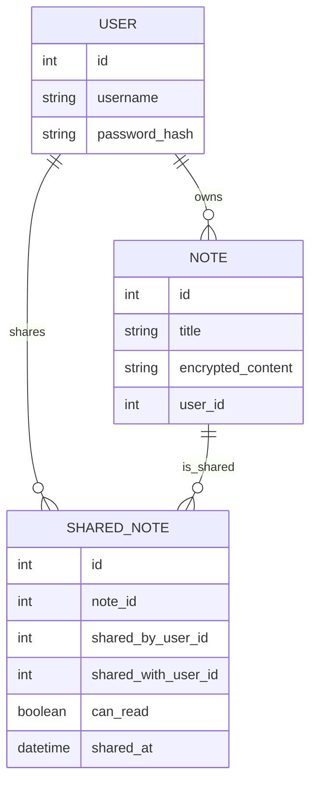

# 📊 Diagrama Entidad–Relación (DER)

```mermaid
erDiagram
    USER {
        int id
        string username
        string password_hash
    }

    NOTE {
        int id
        string title
        string encrypted_content
        int user_id
    }

    SHARED_NOTE {
        int id
        int note_id
        int shared_by_user_id
        int shared_with_user_id
        boolean can_read
        datetime shared_at
    }

    USER ||--o{ NOTE : owns
    USER ||--o{ SHARED_NOTE : shares
    NOTE ||--o{ SHARED_NOTE : is_shared
```
