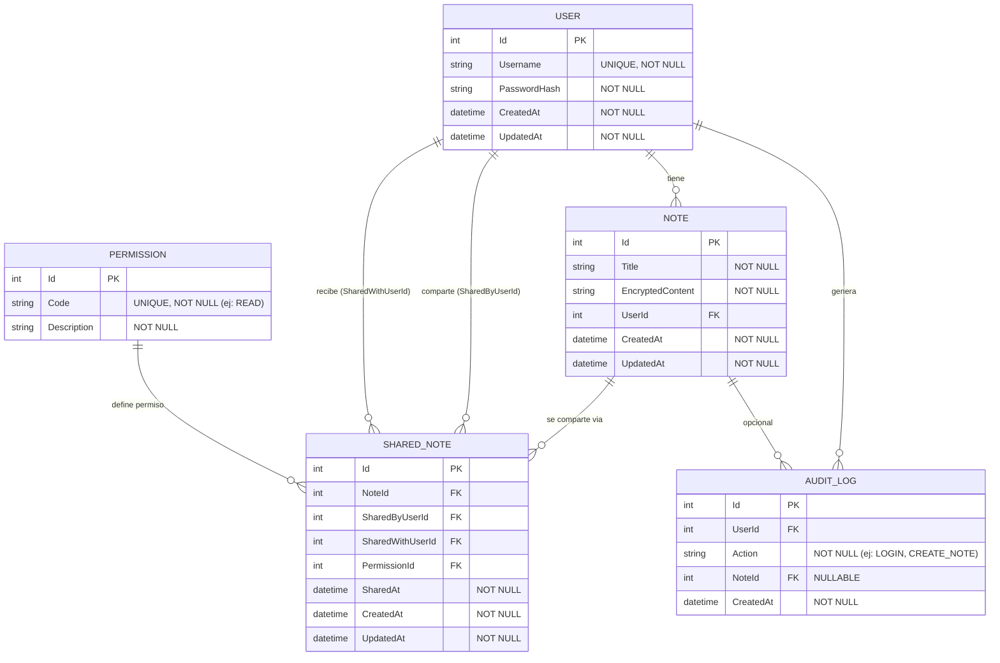

# Diagrama Entidad–Relación (DER)

Este DER describe el **modelo de datos** del proyecto **API BACKEND1** (notas encriptadas con autenticación JWT y compartición controlada).

## 🧩 Entidades 

- **User**: usuario del sistema.
- **Note**: nota privada del usuario (contenido encriptado).
- **SharedNote**: entidad puente para compartir notas (**N–N** entre usuarios y notas).
- **Permission**: catálogo de permisos (p. ej. READ).
- **AuditLog**: bitácora/auditoría de acciones (registro, login, creación/compartición de notas, etc.).

---

---

## ✅ Restricciones / reglas de integridad (ejemplos)

- `User.Username` es **único** (no se permiten usuarios duplicados).
- `Note.EncryptedContent` es **NOT NULL** (la nota nunca se guarda en texto plano).
- `Permission.Code` es **único** (evita duplicar permisos).
- `SharedNote` referencia llaves foráneas válidas (`NoteId`, `SharedByUserId`, `SharedWithUserId`, `PermissionId`).
- Recomendado: índice compuesto para evitar compartir duplicado:
  - `(NoteId, SharedWithUserId)` **UNIQUE** (una nota no se comparte dos veces al mismo usuario).

