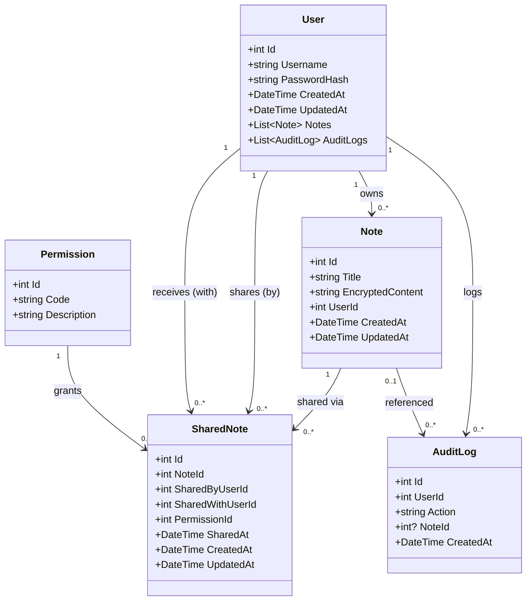

# UML_Clases — Diagrama de Clases (UML)

> **Nota:** este UML representa **solo el dominio (entidades)**.  
> No incluye controladores ni DTOs, porque la consigna pide clases del dominio.

## Lectura rápida

- **User → Note (1–N)**: notas propias.
- **User ↔ Note (N–N)**: compartición mediante **SharedNote**.
- **Permission** define el nivel de acceso de una compartición.
- **AuditLog** registra acciones del usuario (y opcionalmente liga una nota).
