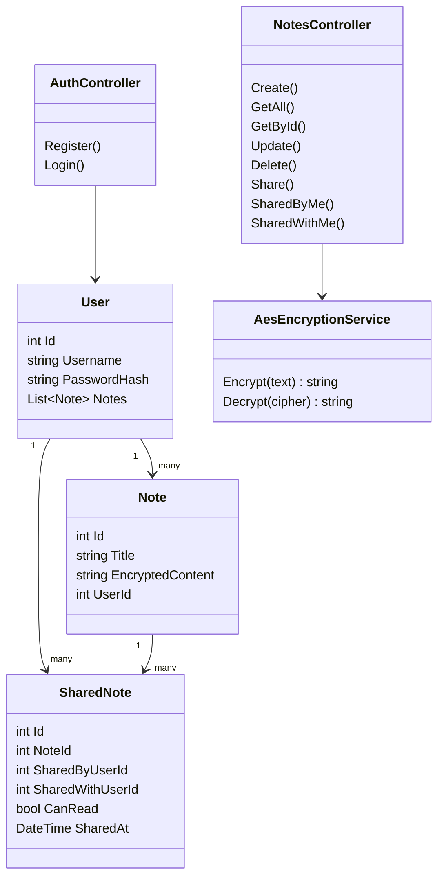

## 🧩 Diagrama UML

```mermaid
classDiagram
    class User {
        int Id
        string Username
        string PasswordHash
        List~Note~ Notes
    }

    class Note {
        int Id
        string Title
        string EncryptedContent
        int UserId
    }

    class SharedNote {
        int Id
        int NoteId
        int SharedByUserId
        int SharedWithUserId
        bool CanRead
        DateTime SharedAt
    }

    class AesEncryptionService {
        Encrypt(text) string
        Decrypt(cipher) string
    }

    class AuthController {
        Register()
        Login()
    }

    class NotesController {
        Create()
        GetAll()
        GetById()
        Update()
        Delete()
        Share()
        SharedByMe()
        SharedWithMe()
    }

    User "1" --> "many" Note
    User "1" --> "many" SharedNote
    Note "1" --> "many" SharedNote
    NotesController --> AesEncryptionService
    AuthController --> User
```